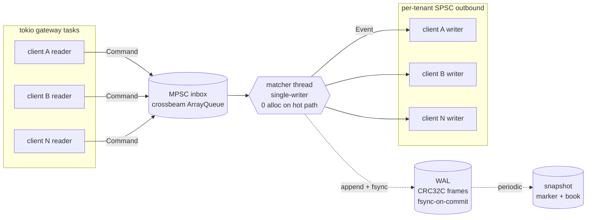

<nav class="chip-nav">
  <a href="#numbers">numbers</a>
  <a href="#architecture">architecture</a>
  <a href="#code">code</a>
  <a href="#decisions">decisions</a>
  <a href="#writeups">write-ups</a>
  <a href="#quickstart">quickstart</a>
</nav>

<section class="hero-sub">

A limit order book matching engine in Rust. Single-writer matcher,
lock-free queues at the boundaries, write-ahead log with byte-exact
replay, machine-verified zero allocation on the hot path.

<p class="hero-badges">
  <a href="https://github.com/pauti04/bourse/actions/workflows/ci.yml"></a>
  <a href="https://github.com/pauti04/bourse/blob/main/LICENSE"></a>
  <a href="https://github.com/pauti04/bourse/blob/main/rust-toolchain.toml"></a>
  <a href="https://github.com/pauti04/bourse"></a>
</section>

<aside class="callout reveal">
<strong>About this project.</strong> A learning portfolio piece built
to understand how a real matching engine is put together. The goal
was to make decisions an interviewer would push on — allocator
behavior, memory ordering, durability semantics, benchmarking
discipline — and <em>measure</em> them rather than hand-wave. What's
here works and is tested; what isn't built is documented honestly.
</aside>

<h2 id="numbers" class="reveal">Headline numbers</h2>

<p class="section-lead reveal">End-to-end on M-series silicon, single matcher thread,
multi-tenant Hub, release build. Each number links to the bench or
test that produced it.</p>

<div class="numbers-grid reveal">
  <a class="num" href="https://github.com/pauti04/bourse/blob/main/crates/bourse-core/benches/engine.rs">
    <div class="value">~225 <span class="unit">ns</span></div>
    <div class="label">in-process round-trip</div>
  </a>
  <a class="num" href="https://github.com/pauti04/bourse/blob/main/crates/bourse-client/src/main.rs">
    <div class="value">~78 <span class="unit">µs</span></div>
    <div class="label">TCP RTT p50 (loopback)</div>
  </a>
  <a class="num" href="https://github.com/pauti04/bourse/blob/main/crates/bourse-client/src/main.rs">
    <div class="value">~307 <span class="unit">µs</span></div>
    <div class="label">TCP RTT p99 (loopback)</div>
  </a>
  <a class="num" href="https://github.com/pauti04/bourse/blob/main/crates/bourse-client/src/main.rs">
    <div class="value">~88 <span class="unit">k/s</span></div>
    <div class="label">TCP throughput (pipelined)</div>
  </a>
  <a class="num" href="https://github.com/pauti04/bourse/blob/main/crates/bourse-core/benches/matcher.rs">
    <div class="value">~94 <span class="unit">µs</span></div>
    <div class="label">matcher walks 1000 levels (~10 M trades/s)</div>
  </a>
  <a class="num" href="https://github.com/pauti04/bourse/blob/main/crates/bourse-core/benches/wal_commit.rs">
    <div class="value">187×–245×</div>
    <div class="label">WAL group commit vs fsync-per-record</div>
  </a>
  <a class="num" href="https://github.com/pauti04/bourse/blob/main/crates/bourse-core/benches/spsc.rs">
    <div class="value">~5.3 <span class="unit">ns</span></div>
    <div class="label">SPSC push+pop, Miri-validated</div>
  </a>
  <a class="num" href="https://github.com/pauti04/bourse/blob/main/crates/bourse-core/tests/no_alloc.rs">
    <div class="value">0</div>
    <div class="label">allocs / 1000 crosses (machine-verified)</div>
  </a>
</div>

<p class="reveal"><a class="text-cta" href="posts/numbers-and-methodology.html">How these numbers were measured →</a></p>

<h2 id="architecture" class="reveal">Architecture</h2>

<div class="arch-grid reveal">
<div class="arch-diagram">



</div>

<aside class="arch-notes">
<ol>
<li><strong>tokio gateways</strong> handle I/O — one reader and one writer task per TCP connection.</li>
<li><strong>MPSC inbox</strong> is a bounded <code>crossbeam_queue::ArrayQueue</code>. Many gateways → one matcher.</li>
<li><strong>The matcher</strong> runs on a dedicated OS thread. Single-writer, no locks, no contention to design around.</li>
<li><strong>Per-tenant SPSC</strong> ring buffers carry events back. Cache-padded head/tail, Acquire/Release ordering, Miri-validated.</li>
<li><strong>WAL</strong> appends every state-changing op with CRC32C framing; fsync before any execution report is sent.</li>
<li><strong>Snapshots</strong> are atomic temp-then-rename, versioned, with both matcher and WAL sequence markers for self-contained recovery.</li>
</ol>
</aside>
</div>

<section class="dark-section reveal">

<h2 id="code">Code spotlight</h2>

<p class="section-lead">Two pieces of code that capture the project's
flavor: the matcher's pre-acceptance gates, and the lock-free SPSC's
push with its safety proof. Both are from the actual main branch — no
pseudo-code.</p>

<div class="code-grid">
<div class="code-card">
<div class="code-card-title">Matcher pre-acceptance gates</div>
<div class="code-card-sub"><code>crates/bourse-core/src/matcher.rs</code></div>

```rust
// Reject upfront if the kind's precondition fails — mirrors the
// zero-qty / duplicate-id path. No `Accepted` is emitted on reject.
let opposite = order.side.opposite();
match order.kind {
    OrderKind::PostOnly { price } => {
        let would_cross = match opposite {
            Side::Sell => self.book.best_ask()
                              .is_some_and(|a| a <= price),
            Side::Buy  => self.book.best_bid()
                              .is_some_and(|b| b >= price),
        };
        if would_cross {
            out.push(Event::Done { reason: DoneReason::Rejected, /* ... */ });
            return;
        }
    }
    OrderKind::Fok { price } => {
        // Bounded pre-walk: stops as soon as enough liquidity is
        // found at acceptable prices.
        let available = self.book.fillable_qty_at(
            opposite, price, order.qty,
        );
        if available < order.qty {
            out.push(Event::Done { reason: DoneReason::Rejected, /* ... */ });
            return;
        }
    }
    _ => {}
}
```

</div>

<div class="code-card">
<div class="code-card-title">Lock-free SPSC push</div>
<div class="code-card-sub"><code>crates/bourse-core/src/spsc.rs</code></div>

```rust
pub fn try_push(&self, item: T) -> Result<(), T> {
    let head = self.head.load(Ordering::Relaxed);
    let next = (head + 1) & self.mask;
    if next == self.cached_tail.get() {
        // Cache says full; pay the cross-core load to refresh.
        let real_tail = self.tail.load(Ordering::Acquire);
        self.cached_tail.set(real_tail);
        if next == real_tail { return Err(item); }
    }
    // SAFETY: head/next are bounded by mask; this slot is past the
    // consumer's tail per the Acquire load above, so the cell is not
    // being read concurrently. We have exclusive access to write.
    unsafe { (*self.buf[head].get()).write(item); }
    // Release publishes the data write to any consumer doing an
    // Acquire load of head — that's the happens-before.
    self.head.store(next, Ordering::Release);
    Ok(())
}
```

</div>
</div>

<p class="reveal" style="margin-top: 1rem"><a class="text-cta light" href="https://github.com/pauti04/bourse/blob/main/crates/bourse-core/src/matcher.rs">Read the full matcher (~750 lines) →</a> &nbsp;&nbsp; <a class="text-cta light" href="https://github.com/pauti04/bourse/blob/main/crates/bourse-core/src/spsc.rs">Read the full SPSC →</a></p>

</section>

<h2 id="decisions" class="reveal">Design decisions, with the why</h2>

<div class="decision-grid reveal">

  <div class="decision">
    <div class="decision-tag">concurrency</div>
    <div class="decision-claim">One matcher thread, no locks.</div>
    <p>The matching engine is single-writer on a dedicated OS thread. Lock-free queues at the boundaries; nothing shared mutable inside the matcher. Performance bottleneck shifts to memory and instructions, not coordination. Scaling out is per-symbol partitioning — not multi-threaded matching.</p>
  </div>

  <div class="decision">
    <div class="decision-tag">numerics</div>
    <div class="decision-claim">Fixed-point <code>i64</code> prices, no floats.</div>
    <p>Floats are non-associative; <code>0.1 + 0.2 != 0.3</code>. Equality comparisons silently lie, rounding bites at boundaries, and behavior varies across architectures. <code>i64</code> with 8 decimal digits is exact, deterministic, single-register, and supports saturating arithmetic — no overflow panics.</p>
  </div>

  <div class="decision">
    <div class="decision-tag">memory</div>
    <div class="decision-claim">Caller owns the event buffer.</div>
    <p><code>Matcher::accept(order, &amp;mut Vec&lt;Event&gt;)</code> reuses a caller-owned <code>Vec</code> across calls — zero allocation per call in steady state. A custom <code>GlobalAlloc</code> harness in <code>tests/no_alloc.rs</code> machine-verifies 0 allocs / 1000 trades. Not "I think it doesn't allocate" — counted.</p>
  </div>

  <div class="decision">
    <div class="decision-tag">durability</div>
    <div class="decision-claim">fsync before ack, group-commit when batching.</div>
    <p>WAL records are CRC32C-framed, length-prefixed, written through a <code>BufWriter</code>, and <code>fsync</code>'d before the execution report goes back to the client. Group commit batches 256 records under one <code>fsync</code> — 187–245× faster than per-record durability.</p>
  </div>

  <div class="decision">
    <div class="decision-tag">memory ordering</div>
    <div class="decision-claim">Acquire/Release pair, validated by Miri.</div>
    <p>The SPSC's correctness rests on a single happens-before relation: producer's Release-store of <code>head</code> synchronizes with consumer's Acquire-load. Hand-walked the argument; each <code>unsafe</code> block has a <code>// SAFETY:</code> proof; Miri runs the unit tests in CI and catches any ordering regression.</p>
  </div>

  <div class="decision">
    <div class="decision-tag">format design</div>
    <div class="decision-claim">Version byte from day 0.</div>
    <p>WAL, snapshot, and wire protocol all carry a 1-byte version from the first byte. Cost: 1 byte per record. Benefit: the slice that added <code>wal_seq</code> tagging to the WAL was a one-line code change. Cheap insurance pays out the first time you need it.</p>
  </div>

</div>

<h2 id="writeups" class="reveal">Long-form write-ups</h2>

<div class="cards reveal">
  <a class="card" href="posts/lock-free-spsc.html">
    <div class="card-eyebrow">memory model</div>
    <div class="card-title">Designing the lock-free SPSC queue</div>
    <div class="card-body">Cache padding, cached views of the other side's index, the Acquire/Release pair, the <code>!Sync</code> trick, and validating the whole thing with Miri in CI.</div>
    <div class="card-cta">Read →</div>
  </a>
  <a class="card" href="posts/wal-and-byte-exact-replay.html">
    <div class="card-eyebrow">durability</div>
    <div class="card-title">Crash-safe matching: WAL + byte-exact replay</div>
    <div class="card-body">CRC32C-framed records, truncation tolerance, snapshots, and the 10 k-order integration test that proves recovery is bit-equal to the live engine.</div>
    <div class="card-cta">Read →</div>
  </a>
  <a class="card" href="posts/numbers-and-methodology.html">
    <div class="card-eyebrow">benchmarking</div>
    <div class="card-title">Numbers, and how they were measured</div>
    <div class="card-body">What each headline number actually measures, where the bench code lives, and what we explicitly don't claim.</div>
    <div class="card-cta">Read →</div>
  </a>
</div>

<h2 id="quickstart" class="reveal">Quickstart</h2>

<p class="section-lead reveal">Single-instrument matcher demo runnable
in 30 seconds without TCP. Walks every order kind including PostOnly
and FOK.</p>

<div class="quickstart reveal">

```bash
git clone https://github.com/pauti04/bourse
cd bourse
cargo run --release -p bourse-core --example basic_match
```

</div>

<p class="section-lead reveal">End-to-end TCP, server + load-gen client:</p>

<div class="quickstart reveal">

```bash
# Terminal 1
cargo run --release -p bourse-server -- 127.0.0.1:9000

# Terminal 2 — 2k RTT samples + 20k throughput burst, HdrHistogram percentiles
cargo run --release -p bourse-client -- 127.0.0.1:9000 2000 20000
```

</div>

<details class="reveal demo-details">
<summary>Sample captured run (real output, M-series, loopback)</summary>

```text
$ bourse-server 127.0.0.1:9000 &
INFO bourse-server listening addr=127.0.0.1:9000
INFO hub started, accepting connections inbox_capacity=8192

$ bourse-client 127.0.0.1:9000 2000 20000
connecting to 127.0.0.1:9000 ...

RTT (sequential):
  samples:    2000
  p50:        78542 ns
  p90:        112125 ns
  p99:        307334 ns
  p99.9:      782500 ns
  max:        1093959 ns

throughput (pipelined burst):
  orders submitted:   20000
  Done(Filled) seen:  10000
  wall time:          228.27ms
  rate:               87616 orders/sec (43808 round-trips/sec)
```

</details>

<h2 id="status" class="reveal">What's built</h2>

<div class="checklist reveal">
  <div class="check">Core types (fixed-point <code>Price</code>, <code>OrderId</code>, <code>Sequence</code>, <code>Side</code>, <code>Qty</code>, <code>Timestamp</code>)</div>
  <div class="check">In-memory order book (<code>BTreeMap</code> per side + <code>HashMap</code> index for O(log n) cancel)</div>
  <div class="check">Matcher with five order kinds: Limit / Market / IOC / PostOnly / FOK</div>
  <div class="check">Lifecycle proptest — per-id state machine covers fill conservation, ordering, leaves_qty</div>
  <div class="check">CRC32C-framed WAL, fsync-on-commit, segment rotation</div>
  <div class="check">Byte-exact replay on 10 000 random orders</div>
  <div class="check">Snapshots with atomic temp-then-rename, <code>wal_seq</code> markers</div>
  <div class="check">Lock-free SPSC ring (Acquire/Release, Miri-validated in CI)</div>
  <div class="check">Lock-free MPSC <code>Hub</code> — one matcher across many TCP connections</div>
  <div class="check">Hand-rolled binary wire protocol with version byte and round-trip proptests</div>
  <div class="check">tokio TCP server + graceful shutdown (SIGINT / SIGTERM)</div>
  <div class="check">Load-gen client with HdrHistogram percentiles (3 sigfig, auto-resize)</div>
  <div class="check"><code>bourse-replay</code> recovery binary</div>
  <div class="check">Allocation-counting harness — 0 allocs / 1000 crosses on the hot path</div>
  <div class="check">WAL group-commit benchmark (187–245× speedup)</div>
  <div class="check"><code>tracing</code> instrumentation on I/O boundaries (hot path untouched)</div>
</div>

<h2 class="reveal">What I learned</h2>

<div class="lessons reveal">

  <div class="lesson">
    <div class="lesson-h">Memory ordering isn't intuition.</div>
    <p>Walking through the Acquire/Release happens-before argument by hand was the first time I felt I actually understood what the C++20 memory model is <em>doing</em> rather than just citing it. Miri catching ordering bugs locally — before they ever became data races in production — is the strongest tooling lesson.</p>
  </div>

  <div class="lesson">
    <div class="lesson-h">"Zero alloc on the hot path" needs a meter.</div>
    <p>Argued it; didn't prove it for many slices. Eventually built the custom-allocator harness and the gap between "I think this is alloc-free" and "the steady-state cross loop is 0 / 1000" was instructive.</p>
  </div>

  <div class="lesson">
    <div class="lesson-h">Property tests find real bugs.</div>
    <p>The matcher's lifecycle proptest caught two real correctness bugs while it was being <em>written</em> — duplicate-id <code>Done</code> collisions and <code>Book::cancel</code> lying about <code>leaves_qty</code>. Both fixed in the same PR.</p>
  </div>

  <div class="lesson">
    <div class="lesson-h">Benchmarks lie if you don't define them carefully.</div>
    <p>The first TCP load-gen reported <code>p50 = 275 ms</code> because it was a closed-loop measurement double-counting queueing delay. The <a href="posts/numbers-and-methodology.html">methodology post</a> walks through what each headline number actually measures and why.</p>
  </div>

  <div class="lesson">
    <div class="lesson-h">Versioning everything from day 0 is cheap.</div>
    <p>WAL, snapshot, and wire protocol each have a version byte from the very first byte. The slice that added <code>wal_seq</code> tagging was a one-line code change because the version byte was already there.</p>
  </div>

</div>

<section class="footer-cta-section reveal">

<p class="footer-cta">
  <a href="https://github.com/pauti04/bourse" class="primary">Open the repo</a>
  <a href="posts/lock-free-spsc.html" class="secondary">Read the SPSC write-up</a>
</p>

<p class="micro">
  Built in Rust 2024 · MIT-licensed · CI green on every push including
  Miri on the lock-free modules ·
  <a href="https://github.com/pauti04/bourse/blob/main/CHANGELOG.md">CHANGELOG</a>
</p>

</section>
